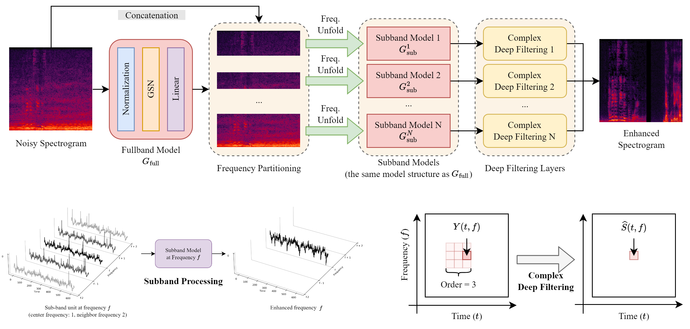

# Spiking-FullSubNet: Intel N-DNS Challenge Track 1 Winner

We are proud to announce that Spiking-FullSubNet has emerged as the [winner of Intel N-DNS Challenge Track 1 (Algorithmic)](https://intel-ncl.atlassian.net/wiki/spaces/INRC/blog/2023/12/01/2027225099/INRC+Forum+12+12+2023.+Clairaudience+Intel+N-DNS+Challenge+Track+1+Algorithmic+Winner.). Please refer to our [brief write-up here](./Spiking-FullSubNet.pdf) for more details. This repository serves as the official home of the Spiking-FullSubNet implementation. Here, you will find:

- A PyTorch-based implementation of the Spiking-FullSubNet model.
- Scripts for training the model and evaluating its performance.
- The pre-trained models in the `model_zoo` directory, ready to be further fine-tuned on the other datasets.

We are actively working on improving the documentation, fixing bugs and removing redundancies. Please feel free to raise an issue or submit a pull request if you have suggestions for enhancements.

## Upcoming Detailed Paper

Our team is diligently working on a comprehensive paper that will delve into the intricate details of Spiking-FullSuNet's architecture, its operational excellence, and the broad spectrum of its potential applications. Please stay tuned!

## Documentation

See the [Documentation](https://haoxiangsnr.github.io/spiking-fullsubnet/) for installation and usage. Our team is actively working to improve the documentation. Please feel free to raise an issue or submit a pull request if you have suggestions for enhancements.

## License

All the code in this repository is released under the [MIT License](https://opensource.org/licenses/MIT), for more details see the [LICENSE](LICENSE) file.